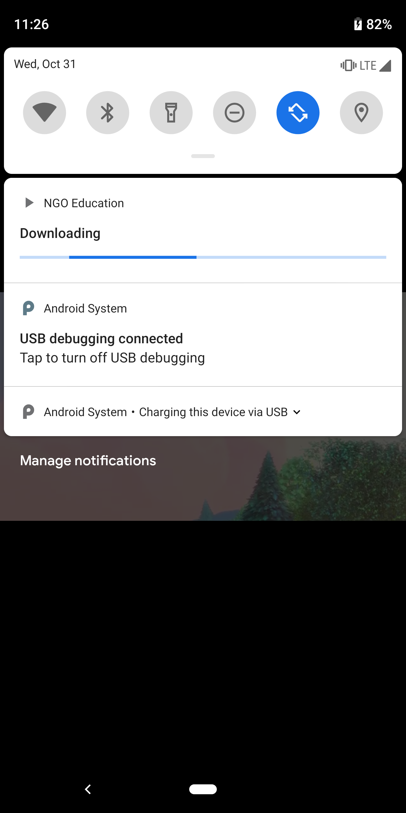

# NGO - Educational Video Streaming

  

## Quick Insight
- An NGO is helping village kids by giving them Android phones so they can watch educational videos. The NGO wants an Android application on which these kids can watch videos. However, the village kids only have internet access in the NGO center. 
- The NGO wants an Android application that saves the video while a kid is watching it. This means that the kid will not need to re-download that video to watch it again. 

## Features and Libraries Used
- ExoPlayer : Core
    - Video Streaming
    - Downloading for Offline Access
- Picture In Picture Mode
- Service to Perform Video Download

**Screenshots** 

